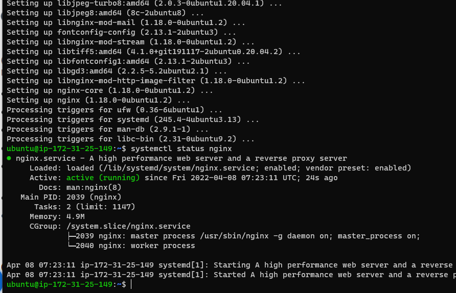
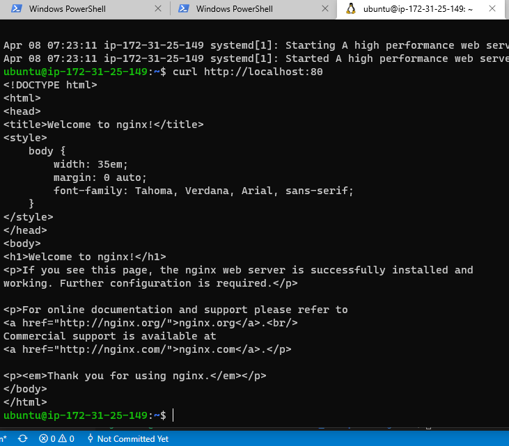
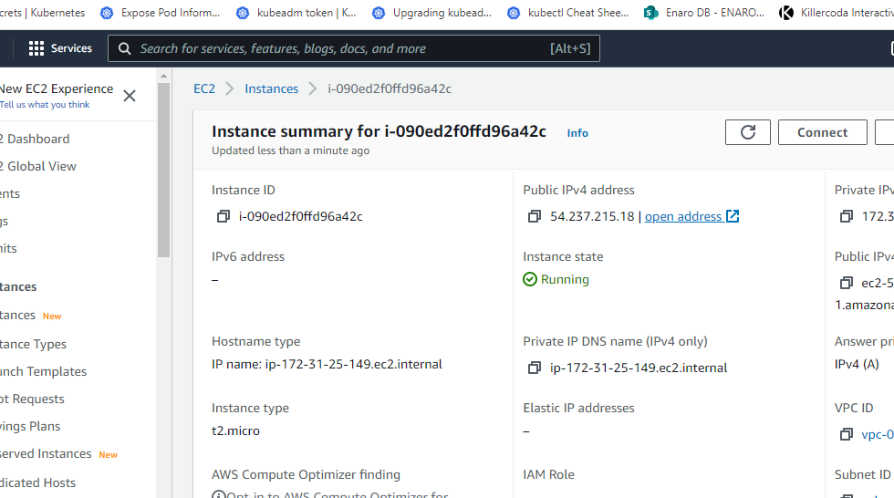
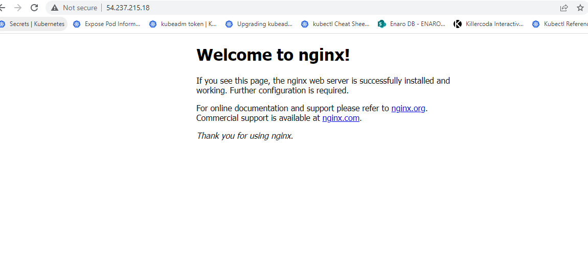
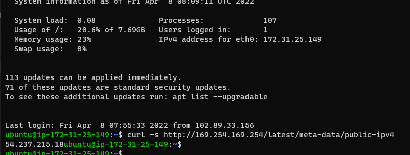
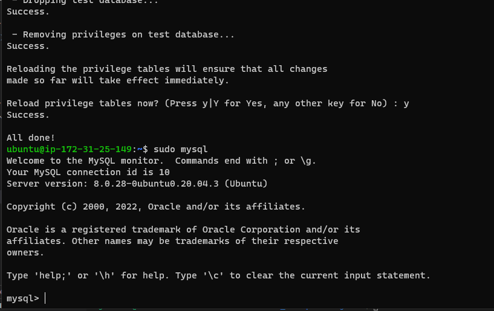
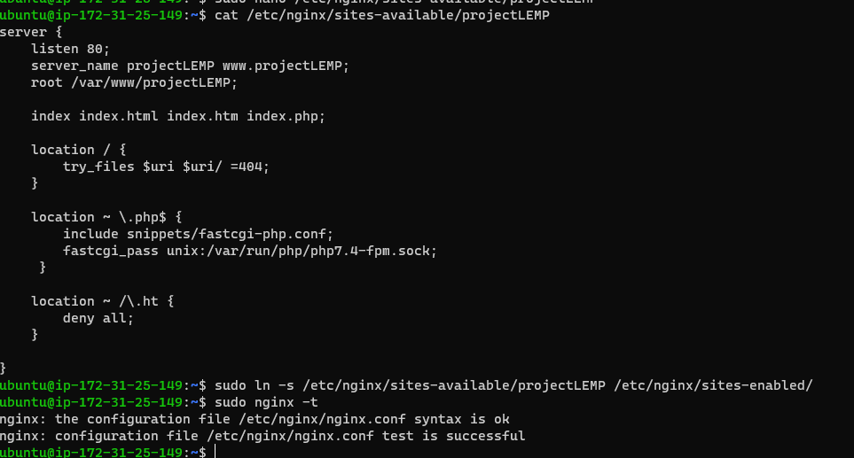
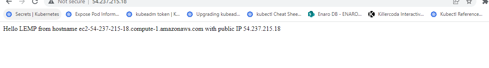
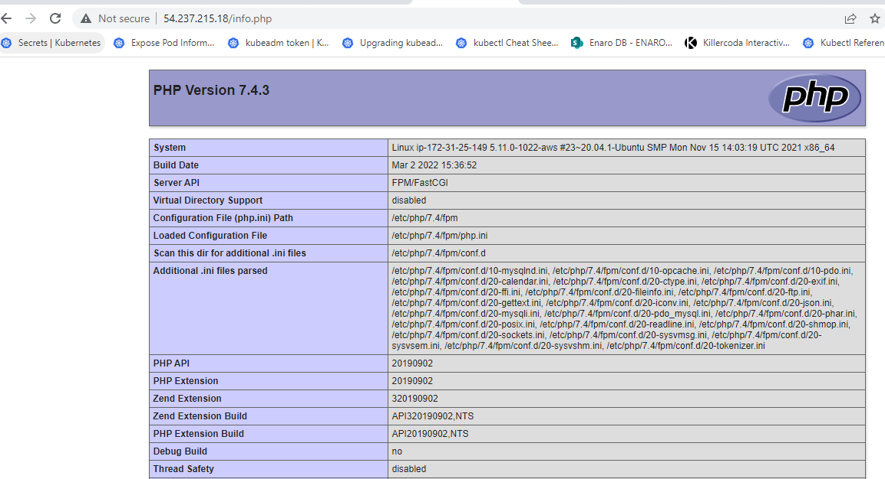

# Project-2
This is for the LEMP stack

 WEB STACK IMPLEMENTATION (LEMP STACK)

##  Project 2 covers similar concepts as Project 1 and helps to cement your skills of deploying Web solutions using LA(E)MP stacks.

In this project I will implement a similar stack, but with an alternative Web Server – NGINX, which is also very popular and widely used by many websites in the Internet

STEP 1 – INSTALLING THE NGINX WEB SERVER

`sudo apt update`

`sudo apt install nginx`

`curl http://localhost:8`

The command use ‘curl’ command to request our Nginx on port 80 (actually you can even try to not specify any port – it will work anyway

Accessing the webserver through the browser:
http://<Public-IP-Address>:80

Another way to get the Public IP address of the nginx webserver without using the AWS console is:
`curl -s http://169.254.169.254/latest/meta-data/public-ipv4`

## STEP 2 — INSTALLING MYSQL
Now that you have a web server up and running, you need to install a Database Management System (DBMS) to be able to store and manage data for your site in a relational database

`sudo apt install mysql-server`

When the installation is finished, it’s recommended that you run a security script that comes pre-installed with MySQL. This script will remove some insecure default settings and lock down access to your database system. Start the interactive script by running:

`sudo mysql_secure_installation`

Let's test if we able to log in to the MySQL console by typing:

`sudo mysql`

Notice that you didn’t need to provide a password to connect as the root user, even though you have defined one when running the mysql_secure_installation script. That is because the default authentication method for the administrative MySQL user is unix_socket instead of password. Even though this might look like a security concern at first, it makes the database server more secure because the only users allowed to log in as the root MySQL user are the system users with sudo privileges connecting from the console or through an application running with the same privileges.

For increased security, it’s best to have dedicated user accounts with less expansive privileges set up for every database, especially if you plan on having multiple databases hosted on your server.

Your MySQL server is now installed and secured. Next, we will install PHP, the final component in the LEMP stack.

## STEP 3 – INSTALLING PHP
You’ll need to install php-fpm, which stands for “PHP fastCGI process manager”, and tell Nginx to pass PHP requests to this software for processing. Additionally, you’ll need php-mysql, a PHP module that allows PHP to communicate with MySQL-based databases. Core PHP packages will automatically be installed as dependencies

To install these 2 packages at once, run:

`sudo apt install php-fpm php-mysql`

## STEP 4 — CONFIGURING NGINX TO USE PHP PROCESSOR
When using the Nginx web server, we can create server blocks (similar to virtual hosts in Apache) to encapsulate configuration details and host more than one domain on a single server. In this guide, we will use projectLEMP as an example domain name.

On Ubuntu 20.04, Nginx has one server block enabled by default and is configured to serve documents out of a directory at /var/www/html. While this works well for a single site, it can become difficult to manage if you are hosting multiple sites. Instead of modifying /var/www/html, we’ll create a directory structure within /var/www for the your_domain website, leaving /var/www/html in place as the default directory to be served if a client request does not match any other sites

Create the root web directory for your_domain as follows:

`sudo mkdir /var/www/projectLEMP`

Next, assign ownership of the directory with the $USER environment variable, which will reference your current system user:

`sudo chown -R $USER:$USER /var/www/projectLEMP`

Then, open a new configuration file in Nginx’s sites-available directory using your preferred command-line editor. Here, we’ll use nano:

`sudo nano /etc/nginx/sites-available/projectLEMP`

This will create a new blank file. Paste in the following bare-bones configuration:

`server {
    listen 80;
    server_name projectLEMP www.projectLEMP;
    root /var/www/projectLEMP;

    index index.html index.htm index.php;

    location / {
        try_files $uri $uri/ =404;
    }

    location ~ \.php$ {
        include snippets/fastcgi-php.conf;
        fastcgi_pass unix:/var/run/php/php7.4-fpm.sock;
     }

    location ~ /\.ht {
        deny all;
    }

}`

Here’s what each of these directives and location blocks do:

listen — Defines what port Nginx will listen on. In this case, it will listen on port 80, the default port for HTTP.
root — Defines the document root where the files served by this website are stored.
index — Defines in which order Nginx will prioritize index files for this website. It is a common practice to list index.html files with a higher precedence than index.php files to allow for quickly setting up a maintenance landing page in PHP applications. You can adjust these settings to better suit your application needs.
server_name — Defines which domain names and/or IP addresses this server block should respond for. Point this directive to your server’s domain name or public IP address.
location / — The first location block includes a try_files directive, which checks for the existence of files or directories matching a URI request. If Nginx cannot find the appropriate resource, it will return a 404 error.
location ~ \.php$ — This location block handles the actual PHP processing by pointing Nginx to the fastcgi-php.conf configuration file and the php7.4-fpm.sock file, which declares what socket is associated with php-fpm.
location ~ /\.ht — The last location block deals with .htaccess files, which Nginx does not process. By adding the deny all directive, if any .htaccess files happen to find their way into the document root ,they will not be served to visitors.

Activate your configuration by linking to the config file from Nginx’s sites-enabled directory:

`sudo ln -s /etc/nginx/sites-available/projectLEMP /etc/nginx/sites-enabled/`

This will tell Nginx to use the configuration next time it is reloaded. You can test your configuration for syntax errors by typing:

`sudo nginx -t`

We also need to disable default Nginx host that is currently configured to listen on port 80, for this run:

`sudo unlink /etc/nginx/sites-enabled/default`

When you are ready, reload Nginx to apply the changes:

`sudo systemctl reload nginx`

Your new website is now active, but the web root /var/www/projectLEMP is still empty. Create an index.html file in that location so that we can test that your new server block works as expected:

`sudo echo 'Hello LEMP from hostname' $(curl -s http://169.254.169.254/latest/meta-data/public-hostname) 'with public IP' $(curl -s http://169.254.169.254/latest/meta-data/public-ipv4) > /var/www/projectLEMP/index.html`

Now go to your browser and try to open your website URL using IP address:

`http://<Public-IP-Address>:80`

You can leave this file in place as a temporary landing page for your application until you set up an index.php file to replace it. Once you do that, remember to remove or rename the index.html file from your document root, as it would take precedence over an index.php file by default.

Your LEMP stack is now fully configured. In the next step, we’ll create a PHP script to test that Nginx is in fact able to handle .php files within your newly configured website.

##STEP 5 – TESTING PHP WITH NGINX
At this point, your LAMP stack is completely installed and fully operational.

You can test it to validate that Nginx can correctly hand .php files off to your PHP processor.

You can do this by creating a test PHP file in your document root. Open a new file called info.php within your document root in your text editor:

`sudo nano /var/www/projectLEMP/info.php`

Type or paste the following lines into the new file. This is valid PHP code that will return information about your server:

`<?php
phpinfo();`

You can now access this page in your web browser by visiting the domain name or public IP address you’ve set up in your Nginx configuration file, followed by /info.php:

http://`server_domain_or_IP`/info.php

After checking the relevant information about your PHP server through that page, it’s best to remove the file you created as it contains sensitive information about your PHP environment and your Ubuntu server. You can use rm to remove that file:

`sudo rm /var/www/your_domain/info.php`

You can always regenerate this file if you need it later

